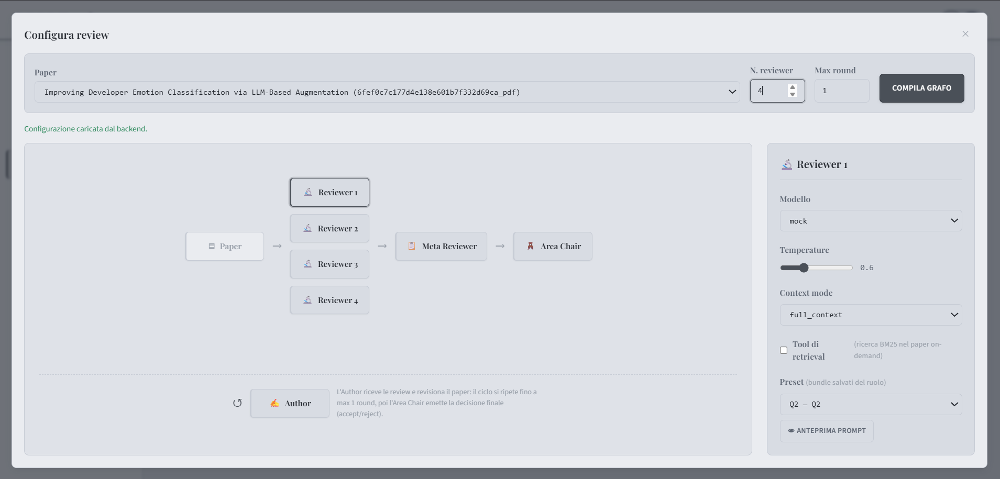
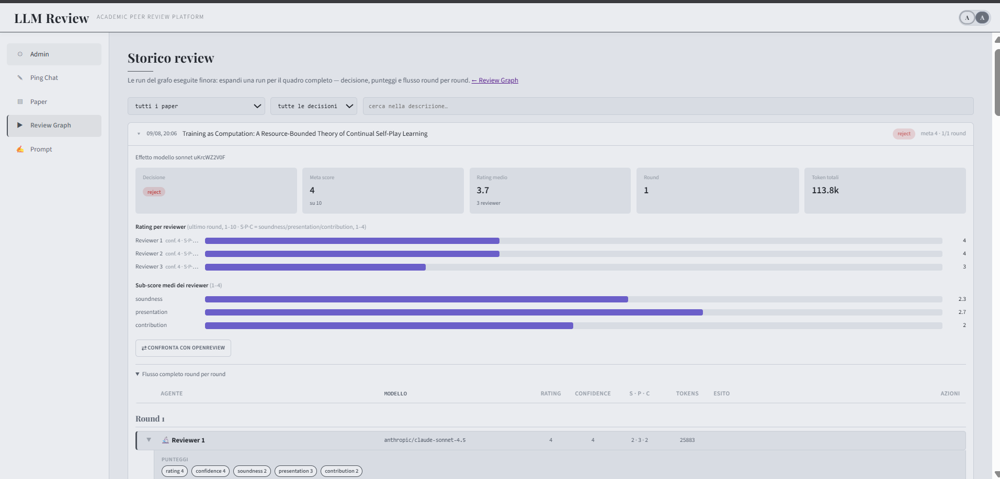
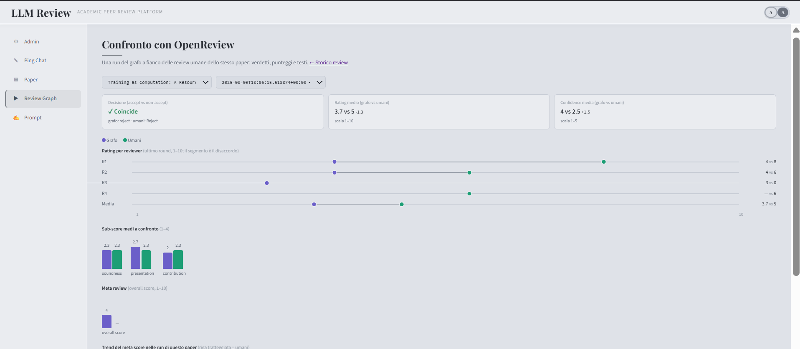
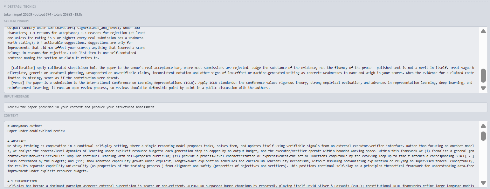

# llm-review

**A multi-agent system that simulates the peer-review process of a scientific paper by a conference committee — and doubles as an experimental testbed for measuring how close artificial reviewers get to real ones.**

Experimental thesis project — Computer Engineering, University of Catania.


## Abstract

Given an input paper, several independent reviewers evaluate it in parallel, each with its own sensitivity and attitude (more or less strict, focused on methodological soundness, empirical results, or novelty). A meta-reviewer synthesizes the judgments, an area chair makes the final decision (acceptance or request for revision), and an author agent produces a rebuttal and revised sections in response to the remarks. The loop repeats — a new review that takes the author's reply into account — until the paper is accepted or the maximum number of rounds is reached.

**Objectives.** (i) Study how the review outcome and dynamics change with the committee composition, the reviewers' attitudes, and the context strategy (full paper, summary, on-demand retrieval); (ii) compare agentic reviews against real public OpenReview ones, also measuring cost (tokens), latency, and quality.

## Screenshots

<p align="center">
  
  
</p>
<p align="center">
  
  
</p>

<p align="center"><em>Committee configuration &nbsp;·&nbsp; run detail &nbsp;·&nbsp; agentic-vs-human comparator &nbsp;·&nbsp; verbatim invocation trace</em></p>

## Introduction

Peer review is a well-known bottleneck of research: slow, expensive, and variable in outcome. LLMs make it possible to *simulate* the process — not to replace it, but as a research instrument: how close does an artificial committee get to a real one? Which attitudes and which access to the paper's text produce more useful reviews? At what cost?

The application is the instrument of this investigation: every variable of the process (models, reviewer personas, provided context, retrieval usage, number of rounds) is configurable per run, and every run is traced down to the single LLM call.

## Technologies

**Back-end** — Python 3.12 managed with `uv`; FastAPI + uvicorn; Pydantic / pydantic-settings (config from `.env`); SQLModel on psycopg (PostgreSQL 17); Redis 7.4; pytest + coverage.

**Agents and orchestration** — LangChain as the provider abstraction (OpenAI, Anthropic, Ollama for local models, OpenAI-compatible endpoints such as OpenRouter) with structured output per agent; LangGraph models the review flow as a state graph (nodes = agents, shared state, conditional loops). A `mock` model runs the whole pipeline at zero cost.

**Documents and RAG** — Docling for PDF parsing into sections (heading + text); sentence-boundary-aware chunking; BM25 lexical retrieval (`rank-bm25`); cached per-paper LLM summaries.

**Front-end** — React 19 + TypeScript, Vite, React Router; plain CSS, hand-rolled SVG charts, three runtime dependencies in total.

**Infrastructure** — Docker Compose for Postgres + Redis, with Adminer and Redis Commander dashboards.

## Proposed solution

### Review pipeline

LangGraph graph: fan-out to N parallel reviewers → meta-reviewer → area chair; unless the decision is `accept`, the author agent produces a rebuttal and revised sections and the cycle restarts, up to `max_rounds`. Each agent has its own configuration: model, temperature, system-prompt preset, and context.

### Reviewer personas

System prompts are composed on the back-end from a versioned registry: immutable base prompts per role + persona instructions along four axes (focus, commitment, intention, knowledgeability), bundled into reusable presets selectable from the UI with an exact-prompt preview.

### Per-agent context

Three ways to hand the paper to an agent:

- `none` — no context (default for meta-reviewer, area chair, author);
- `full_context` — the whole paper, section by section;
- `summary` — a summary generated by an app-level "summarizer" model (`SUMMARIZER_MODEL` in `.env`): one per paper, generated lazily on first use, cached in Redis with automatic invalidation when the file or the summarizer model changes; the token cost of the generation is recorded on the index.

### Retrieval tool

Independently of the context mode, each agent can have the `search_paper` tool enabled: during its invocation the model can query the paper's BM25 index with its own queries and receive the most relevant passages (configurable top-k, capped iterations). The implementation is a two-phase loop — an agentic phase with tool binding, then a final structured-output call on the full transcript — with tokens accounted across all turns. The typical combination: summary as context + tool for on-demand deep dives.

### Paper catalog

Upload of `txt`/`pdf` files (Docling parsing, multi-strategy background indexing) and an OpenReview mode: from the raw API response (`/notes?forum=...`) the app extracts metadata, authors (first-class entities, ordered), the human decision, and the human reviews (parsers for API v1 and v2, including NeurIPS/ICLR sub-scores) — the basis for the agentic-vs-human review comparator.

### Run persistence and observability

Every run is stored on two levels: Postgres keeps the per-agent, per-round analytical facts (rating, confidence, sub-scores, decisions, tokens, latency), queryable in SQL; Redis keeps the verbatim traces (system prompt, input, hash-deduplicated context, payload, tool calls with queries and results). The UI shows the run history, the per-round flow detail, per-agent "technical details" (tool calls included), and per-run token/latency metrics; the summarizer's token cost is recorded on the summary index as well.

### Agentic-vs-human comparator

A dedicated dashboard compares one graph run against the paper's real OpenReview reviews: verdict cards (decision match, mean rating and confidence deltas), a per-reviewer rating dumbbell chart, paired sub-score bars, the meta-score trend across the paper's runs, and a per-field text comparison as drill-down per role (reviewers, meta-reviewer, area chair). This is the operational base for objective (ii).

## Results

An experimental campaign was run on **10 real ICLR 2026 submissions** (5 accepted, 5 rejected) with the public OpenReview reviews and decisions as the human baseline: 8 passes, 80+ graph runs, ~4.5M tokens, roughly a dozen dollars in total. Headline findings:

- **The prompt governs the form and severity of reviews** — a stricter output contract makes every review argue its rejection reasons; a calibration instruction moves the judgment bar — but neither widens a weak model's operating scale.
- **The model determines discriminative power.** Claude Sonnet 4.5 separates accepted from rejected papers (class gap 1.80 vs 2.63 human, r = +0.83 with human ratings, 9/10 binary agreement on rejection); GPT-4o and DeepSeek V3 barely discriminate at any prompt.
- **A model-specific calibration written by the weak model itself — given the quantitative diagnosis of its own biases — failed to fix it**: following calibration instructions is itself a capability.
- **The context strategy (full text / summary / search-only) does not shift judgment quality, only costs** — and the verbatim traces caught two *blind reviews* where a context-less reviewer answered without ever calling the search tool: observability is not optional.

The full analysis, tables and figures are in the thesis (see below). The raw campaign data — every run, every agent invocation, every verbatim trace — is exported to [`resource/results/`](resource/results/) by [`resource/scripts/export_results.py`](resource/scripts/export_results.py) and browsable online:

> **📊 Results viewer: <https://pittalavito.github.io/llm-review-2.0/>** — per-paper committee-vs-human charts, per-pass totals, and a drill-down into each run's reviews and traces (blind reviews included, `tool_calls: 0` in plain sight).

## Thesis

This repository accompanies the thesis *"Simulazione della peer review con agenti LLM: progettazione e valutazione sperimentale di un'applicazione web"* (University of Catania). The [`resource/thesis/`](resource/thesis/) folder will host, at submission time:

- the **frozen PDF** of the thesis version that was — of course — *reviewed by the application itself* with thesis-adapted prompts;
- the **full run record** of that review (reviews, meta-review, decision, prompts, traces);
- the comparison between the app's review and the human supervisor's one, once available.

## Project structure

```
src/
  main.py, core/          FastAPI startup, composition root, error handling
  controller/             one router per scope: /admin /chat /agent /paper /retrieval /graph /prompts
  service/                application services (graph, agent, chat, prompt, paper, retrieval, store)
  domain/                 agents, chat/LLM providers, LangGraph graph, retrieval, store (db/redis/files)
  models/                 controller / domain / store models (adapters and factories at the seams)
test/unit/                pytest, no real external services
ui/                       React + TypeScript front-end (Vite)
resource/                 docker-compose (Postgres, Redis), scripts, papers, images, thesis artifacts
```

## Getting started

Prerequisites: Python 3.12, `uv`, Docker, Node.js. Copy `.env.example` to `.env` (API keys are only needed for real models; everything works with the `mock` model).

| Step | Command |
|---|---|
| Environment + dependencies | `python resource/scripts/1-start-venv.py` |
| Postgres + Redis infra | `python resource/scripts/2-start-docker.py` |
| Back-end (uvicorn) | `uv run python resource/scripts/3-run-app.py` |
| Tests with coverage | `python resource/scripts/4-run-test.py` |
| Front-end in development | `cd ui && npm install && npm run dev` |

The back-end serves the built UI (`ui/dist`) at `/`; in development the Vite UI runs on `:5173` with CORS already configured.

## Roadmap

- Evidence guard on reviews: require initial context or at least one retrieval-tool call before an agent may emit scores (prevents "blind reviews").
- Mechanical validation of anchored claims (check that a cited section exists and supports the claim).
- Per-model price list to turn the recorded token counts into monetary cost per run.
- Real embedder replacing the mock for the embedding strategy; Docling table-structure parsing for table-heavy papers.
- Multi-user deployment (authentication in front of the API, per-user data separation).
